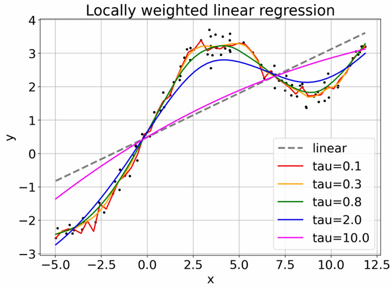

# Polynomial Linear Regression

This project implements polynomial linear regression from scratch in Python using NumPy. It includes:

- Polynomial feature expansion
- Least squares objective calculation
- Batch gradient descent (BGD)
- Stochastic gradient descent (SGD)
- Visualizations and analysis in a Jupyter notebook

### 📈 Locally Weighted Linear Regression (Bonus Visualization)

This project also explores **Locally Weighted Linear Regression (LWLR)**, a non-parametric algorithm that fits a linear model around each query point using a Gaussian kernel to assign weights to nearby training samples.

The plot below shows how different values of the bandwidth parameter `τ` affect the model's flexibility and smoothness:



- **Dashed Gray Line**: Traditional linear regression (OLS), which fits a single global model to all data points.
- **Colored Curves**: LWLR fits for different `τ` values:
  - `τ = 0.1` and `τ = 0.3` (red, orange): Capture local patterns with high flexibility but can be sensitive to noise.
  - `τ = 0.8` and `τ = 2.0` (green, blue): Provide a balance between smoothness and flexibility.
  - `τ = 10.0` (pink): Approximates global linear regression as the kernel becomes too broad to detect local variations.

This visualization highlights how LWLR dynamically adapts to data structure by adjusting the effective model complexity through `τ`.

## 📁 Files

- `linear_regression.py`: Core implementation of data loading, feature generation, training objective, and optimization methods.
- `linear_regression.ipynb`: Demonstration and analysis of training using both BGD and SGD.

## 🧠 Algorithms Implemented

- **Polynomial Feature Generation**  
  Converts scalar input features into polynomial feature vectors.

- **Least Squares Objective**  
  Calculates the training loss based on squared error.

- **Gradient Descent Algorithms**  
  - **Batch Gradient Descent**: Uses the full dataset for each gradient update.
  - **Stochastic Gradient Descent**: Updates weights using one example at a time.

**Example Code for SGD:**

```python
def stochastic_gradient_descent(
    X_train: np.ndarray,
    y_train: np.ndarray,
    eta=4e-2,
    max_epochs=200,
) -> Tuple[np.ndarray, Dict[str, Any]]:
    """Stochastic gradient descent for linear regression that fits the
    feature matrix `X_train` to target `y_train`.

    Args:
        X_train: the feature matrix, with shape (N, M).
        y_train: the target label for regression, with shape (N, ).
        eta: Learning rate.
        max_epochs: Maximum iterations (epochs) allowed.
    Returns: A tuple (w, info)
        w: The coefficient of linear regression found by SGD. Shape (M, ).
        info: A dict that contains additional information (see the notebook).
    """
    N = X_train.shape[0]
    M = X_train.shape[1]
    w = np.zeros(M, dtype=y_train.dtype)
    
    train_objective_list = []
    convergence_iters = []
    for current_epoch_number in range(max_epochs):
        for x_data_point, y_data_point in zip(X_train, y_train):
            ###################################################################
            # In this block, you are required to update w from a single 
            # (x_data_point, y_data_point).
            ###################################################################
            gradient = (x_data_point.dot(w) - y_data_point) * x_data_point
            w -= eta * gradient
            ###################################################################
            #                        END OF YOUR CODE                         #
            ###################################################################
            # check whether all w is 0.0
            assert np.any(w != 0.0)

        objective = compute_objective(X_train, y_train, w)
        train_objective_list.append(objective)
    
    info = dict(
        train_objectives=train_objective_list,
    )
    return w, info
```

## 📊 Sample Use Case

This is a simple learning exercise for understanding how regression models work under the hood. You can adjust the degree of polynomial and learning rate to see how they affect training and convergence.

## 📌 Requirements

- Python 3.x
- NumPy
- Jupyter (for `.ipynb` usage)

## 🧑‍💻 Author

Created by Hao-Chun Shih (Oscar) as part of a regression algorithm study.
